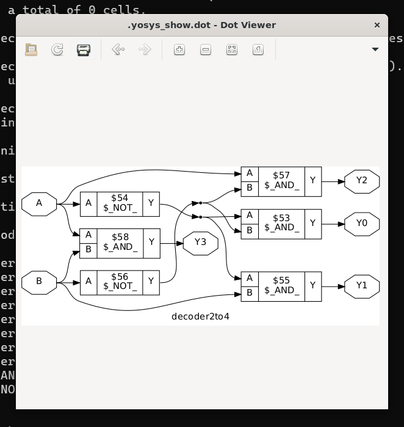
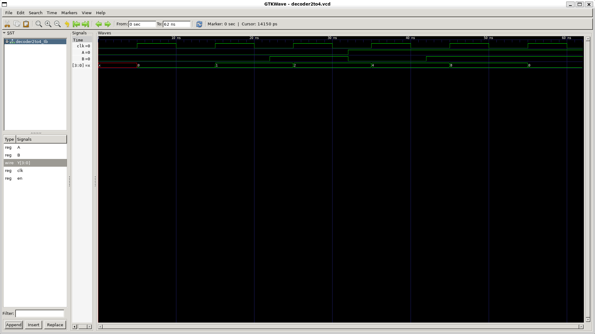
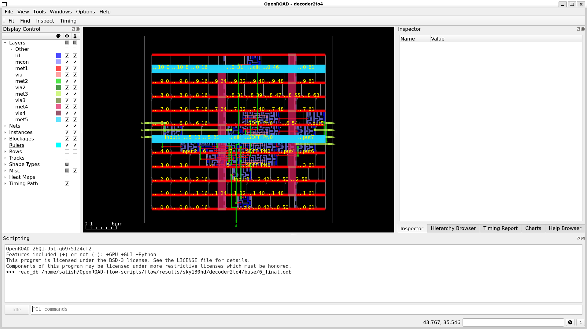

---

## 📊 Implementation Results

The following results were obtained from the completed RTL-to-GDSII implementation using the SKY130HD standard-cell library.

| Parameter | Result |
|---|---:|
| Process Technology | SKY130 |
| Standard-Cell Library | SKY130HD |
| Supply Voltage | 1.8 V |
| Clock Period | 10 ns |
| Target Frequency | 100 MHz |
| Total Power | 42.3 µW |
| Worst-Case IR Drop | 89.1 µV |
| Average IR Drop | 16.7 µV |
| Wire Length – met1 | 83.17 µm |
| Wire Length – met2 | 92.77 µm |
| Wire Length – met3 | 33.28 µm |

> **Note:** The power and IR-drop values are taken from the OpenROAD post-route analysis reports. Wire-length values are obtained from the detailed routing report.

---

## 📸 Visual Results

### 1. Yosys Synthesis

The RTL design was synthesized using Yosys and mapped to SKY130HD standard cells.



---

### 2. Gate-Level Simulation

The final gate-level netlist was simulated using Icarus Verilog and the resulting waveform was analyzed using GTKWave.



---

### 3. Final OpenROAD Layout

The final physical implementation was loaded in the OpenROAD GUI after placement, clock-tree synthesis, routing, filler insertion, and final extraction.



---

## 📁 Repository Structure

```text
decoder2to4-openroad/
│
├── rtl/
│   └── decoder2to4.v
│
├── tb/
│   └── decoder2to4_tb.v
│
├── constraints/
│   └── decoder2to4.sdc
│
├── scripts/
│   ├── area.tcl
│   ├── timing.tcl
│   ├── power.tcl
│   ├── wirelength.tcl
│   ├── ircheck.tcl
│   └── iranalysis.tcl
│
├── reports/
│   ├── area.txt
│   ├── timing.txt
│   ├── power.txt
│   ├── wirelength.txt
│   └── ir_drop.txt
│
├── simulation/
│   ├── decoder2to4.vcd
│   └── gate_decoder2to4.vcd
│
├── results/
│   ├── 6_final.v
│   ├── 6_final.def
│   ├── 6_final.gds
│   └── 6_final.spef
│
├── images/
│   ├── yosys_synthesis_schematic.png
│   ├── gtkwave_functional_simulation.png
│   └── openroad_final_layout.png
│
└── README.md
